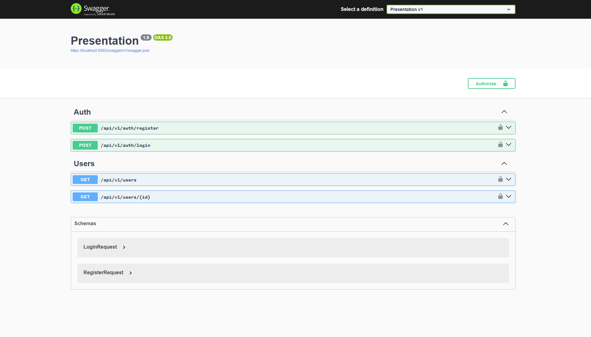

# Auth Forge API

[](https://dotnet.microsoft.com/)
[](https://dotnet.microsoft.com/)
[](LICENSE)

A robust and modular authentication API built from scratch using modern software engineering principles and best practices.

AuthForge is an independent identity provider designed to serve as a centralized authentication service for applications, APIs, and microservices. The project was created with a strong focus on Clean Architecture, maintainability, security, and scalability.



## ✨ Features

* User registration
* User authentication (Login)
* JWT-based authentication and authorization
* Argon2id password hashing
* SQL Server integration
* Dapper-based data access
* Clean Architecture implementation
* Dependency Injection
* Swagger/OpenAPI documentation


## 🏗️ Architecture

The solution follows the principles of **Clean Architecture** and **Separation of Concerns (SoC)**.

```text
AuthForge
├── Presentation
├── Application
├── Domain
├── Infrastructure
└── Tests
```

### Layers

#### Domain

Contains the core business entities and contracts.

* Entities
* Interfaces
* Domain rules

#### Application

Implements the application's business logic.

* Authentication services
* User services
* Use cases
* Application contracts

#### Infrastructure

Responsible for external concerns.

* Dapper repositories
* SQL Server integration
* JWT services
* Argon2id password hashing

#### Presentation

API layer responsible for handling HTTP requests and responses.

* Controllers
* Middleware configuration
* Dependency Injection
* Authentication setup


## 🔐 Security

AuthForge follows modern authentication and security practices.

### Password Hashing

Passwords are secured using **Argon2id**, one of the most recommended password hashing algorithms available today.

### Authentication

Authentication is handled through **JWT (JSON Web Tokens)** with:

* Signature validation
* Expiration validation
* Issuer validation
* Audience validation

### Secrets Management

Sensitive configuration values are stored using **User Secrets** during development and can be replaced by environment variables or secret managers in production.


## 🛠️ Getting Started

### 1. Clone the Repository

```bash
git clone https://github.com/thesampaio/AuthForge.git
cd AuthForge
```

### 2. Configure the Database

Execute the SQL scripts located in the `Database` folder to create the database structure and required stored procedures.

### 3. Configure JWT Secret

Initialize User Secrets:

```bash
dotnet user-secrets init
```

Add your JWT secret key:

```bash
dotnet user-secrets set "JwtSettings:SecretKey" "YourSuperLongAndSecureSecretKey"
```

### 4. Configure the Connection String

Update your `appsettings.json`:

```json
{
  "ConnectionStrings": {
    "DefaultConnection": "Your SQL Server connection string"
  }
}
```

### 5. Run the Application

```bash
dotnet run --project Presentation
```


## 📚 API Endpoints

| Method | Endpoint                | Description                                     |
| ------ | ----------------------- | ----------------------------------------------- |
| POST   | `/api/v1/auth/register` | Register a new user                             |
| POST   | `/api/v1/auth/login`    | Authenticate and receive a JWT                  |
| GET    | `/api/v1/users`         | Retrieve active users (Requires Authentication) |
| GET    | `/api/v1/users/{id}`    | Retrieve a user by ID (Requires Authentication) |


## 📖 API Documentation

Once the application is running, Swagger UI will be available at:

```text
/swagger
```

This interface allows you to test and explore all available endpoints.


## 🧪 Technologies

| Category          | Technology         |
| ----------------- | ------------------ |
| Framework         | .NET 9             |
| Language          | C# 13              |
| Database          | SQL Server         |
| Data Access       | Dapper             |
| Authentication    | JWT                |
| Password Security | Argon2id           |
| API Documentation | Swagger/OpenAPI    |
| Architecture      | Clean Architecture |


## 📄 License

This project is licensed under the MIT License. See the [LICENSE](LICENSE) file for more information.


## 👨‍💻 Author

**Kellvyn Sampaio**

* GitHub: https://github.com/thesampaio
* Portfolio: https://thesampaio.github.io/Portfolio/

---

### Educational Purpose

This project was developed primarily for learning, experimentation, and demonstrating software engineering best practices.
